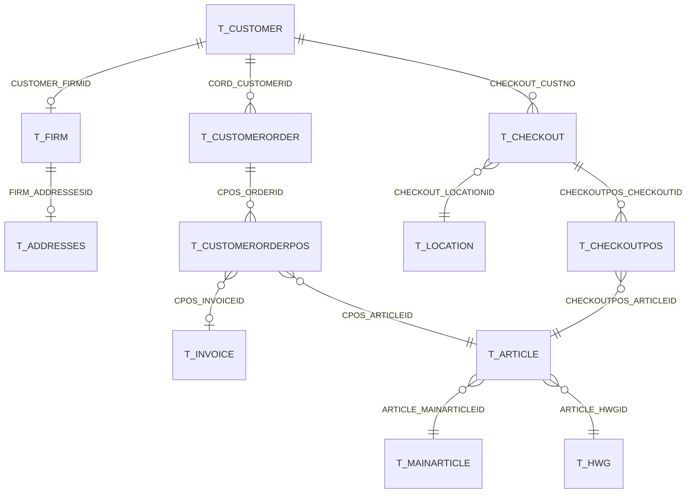

# Reverse Engineering: Datenmodell aus SQL-Queries

===USER===
Das Kundenportal (`portal-frontend`) führt SQL direkt gegen die ProlixPro-Oracle-DB aus. Jede Query liegt als eigene `.sql`-Datei im Frontend und wird per `?raw`-Import über `executeQuery()` ausgeführt.

Reverse-engineere daraus das Datenmodell: Welche Tabellen und Spalten der DB nutzt das Portal tatsächlich, und wie hängen sie zusammen?

Vorgehen:
1. Finde alle `.sql`-Dateien unter `app/` und lies sie vollständig.
2. Leite daraus die verwendeten Tabellen, Spalten und Joins ab.
3. Gruppiere fachlich (Kunde, Artikel, Transaktionen, Belege, Reports), nicht alphabetisch.
4. Erstelle zusätzlich eine Tabelle "Feature → SQL-Datei → Kerntabellen".

Das Backend (`hq-portal-backend`) ist Legacy-Fallback und interessiert nicht. Schreib das Ergebnis nach `docs/db-datenmodell.md`.

===AGENT duration="3 min 24 s"===
Ich sammle zuerst alle Queries ein.

===TOOL===
$ find app -name "*.sql" | sort
app/common/audit-log/select_hub_search_api_url.sql
app/features/alcohol-report/select_alcohol_extract.sql
app/features/invoices/select_checkout_pdf.sql
app/features/invoices/select_invoice_positions.sql
app/features/invoices/select_invoices.sql
app/features/mwst-report/select_mwst.sql
app/features/productinformation/productinfo.sql
app/features/rekap-report/select_rekap.sql
app/features/revenue-report/select_revenue.sql
app/features/sdb-report/select_sdb.sql
app/features/shipments/select_shipments.sql
app/features/sustainability-report/revenue-per-label.sql
app/shell/select_customer.sql
... (26 Dateien insgesamt)

===AGENT===
Ich habe alle 26 Queries gelesen. Ein Muster zieht sich durch praktisch jeden Report — das ist der Schlüssel zum ganzen Modell:

Fast alle Auswertungen vereinigen zwei getrennte Verkaufskanäle per `UNION ALL`:

| Kanal | Bedeutung | Beleg-Kopf | Position | Datum | Storno-Filter |
|---|---|---|---|---|---|
| **AGH** | Abhol-Grosshandel (Cash & Carry) | `T_CHECKOUT` | `T_CHECKOUTPOS` | `CHECKOUT_DATE` | `CHECKOUT_CANCELDATE IS NULL` |
| **BGH** | Belieferungs-Grosshandel | `T_CUSTOMERORDER` | `T_CUSTOMERORDERPOS` | `CPOS_DELIVERYDATE` | `CPOS_STATE = 'CLEARED'` |

Drei weitere Konstanten, die überall wiederkehren:

- Artikelnummer ist immer `SUBSTR(ARTICLE_NO, 1, 6)` — der Rest sind Varianten
- `HWG_ID != 12` wird durchgehend ausgefiltert
- Belege/PDFs liegen als Blob direkt in den `*RECEIPT`-Tabellen

Zwei Dinge kann ich aus den Queries **nicht** ableiten und markiere sie als offen:

1. Warum `HWG_ID != 12` ausgefiltert wird — steht in keinem Kommentar.
2. Ob `T_SDBSHIPPING` wirklich so heisst; die Query nutzt vier Spalten, die ich in keinem Mapping finde.

===TOOL===
$ write docs/db-datenmodell.md
docs/db-datenmodell.md geschrieben (10 Abschnitte, 340 Zeilen)

===AGENT===
Aufbau: Verkaufskanäle → Kunde/Identität → Artikelstamm → AGH → BGH/Rechnungen → Fachbereiche (Lieferungen, SDB, Nachhaltigkeit) → Querschnittsthemen → Feature-Matrix.

Eine Sache ist mir aufgefallen: Die lange `DECODE`-Umsatzformel (Mengenrabatt, Fixpreis, Freimenge, Lieferantenrabatt, Bargain) ist in sechs Reports wortgleich dupliziert. Fachlich identisch, aber sechsfach gepflegt.

===USER===
Verifiziere jetzt jede Tabelle und jede Spalte gegen zwei unabhängige Quellen:

- die Hibernate-Mappings (`.hbm.xml` unter `prolixpro/server/ProdegaJpa`)
- für alles, was dort nicht gemappt ist: den Oracle-Katalog über `pptest_mcp` (nur lesend)

Halte am Ende der Doku fest, was wie verifiziert wurde, und markiere explizit die Fälle, wo das Portal Spalten nutzt, die Hibernate gar nicht kennt.

===TOOL===
$ grep -rl "T_CHECKOUTPOS\|T_CUSTOMER\|T_ARTICLE" prolixpro/server/ProdegaJpa --include=*.hbm.xml
prolixpro/server/ProdegaJpa/src/main/resources/.../Customer.hbm.xml
prolixpro/server/ProdegaJpa/src/main/resources/.../Checkout.hbm.xml
prolixpro/server/ProdegaJpa/src/main/resources/.../CheckoutPos.hbm.xml
prolixpro/server/ProdegaJpa/src/main/resources/.../Article.hbm.xml
... 31 Mappings gefunden

===AGENT duration="2 min 51 s"===
Der Grossteil deckt sich exakt: Kunde, Firma, Adresse, Person, User, Parameter, PLZ, Artikel, MainArticle, alle `*TEXT`-Tabellen, HWG, AGR, Gastro, Einheiten, Checkout(Pos), CustomerOrder(Pos), Invoice, AghRecap, Shipment, Fact, Pikt — Tabellen- und Spaltennamen stimmen 1:1.

Vier Objekte finde ich in keinem Mapping. Die prüfe ich direkt im DB-Katalog:

===TOOL===
$ oracle connect pptest_mcp (read-only)
Connected.

$ oracle run-sql "SELECT table_name, column_name, data_type FROM all_tab_columns WHERE owner='PPADMIN' AND ((table_name='T_LOCATION' AND column_name LIKE 'LOCATION_NAME%') OR (table_name='T_CHECKOUTPOS' AND column_name='CHECKOUTPOS_RETAILPRICE') OR table_name='T_SDBSHIPPING')"
T_LOCATION      LOCATION_NAME                  VARCHAR2
T_LOCATION      LOCATION_NAME_F                VARCHAR2
T_CHECKOUTPOS   CHECKOUTPOS_RETAILPRICE        NUMBER
T_SDBSHIPPING   SDBSHIPPING_LASTCUSTOMERNUMBER NUMBER
T_SDBSHIPPING   SDBSHIPPING_LASTPURCHASE       DATE
T_SDBSHIPPING   SDBSHIPPING_MAINARTICLEID      NUMBER
T_SDBSHIPPING   SDBSHIPPING_LASTARTICLEID      NUMBER

7 rows selected.

===AGENT===
Alle vier bestätigt — und das ist der interessante Befund:

- `T_LOCATION.LOCATION_NAME` / `LOCATION_NAME_F` → existieren als `VARCHAR2`, sind aber **nicht** im Hibernate-Mapping. Java liest den Standortnamen über die verknüpfte `LocationAdr`-Entität; die Portal-Queries greifen direkt auf die Spalten zu.
- `T_CHECKOUTPOS.CHECKOUTPOS_RETAILPRICE` → existiert als `NUMBER`, ebenfalls nicht gemappt.
- `T_SDBSHIPPING` → reale Tabelle, alle 4 Spalten bestätigt, kein Mapping.
- `V_GFGARTIKEL_SDB` ist eine View, `MV_FACTDATA` und `MV_ARTICLE_EXPORT_INDEX` sind Materialized Views — deshalb kein HBM.

Das heisst konkret: **Das Portal nutzt DB-Spalten, die im ORM des Monolithen nicht existieren.** Wer die Tabellen über Hibernate umbaut, sieht die Portal-Abhängigkeit nicht.

Ich habe das als eigenen Abschnitt "10. Verifikation" in die Doku aufgenommen, inklusive Fussnoten an den betroffenen Tabellen.

Nachtrag zu meiner offenen Frage von vorhin: `HWG_ID != 12` konnte ich auch jetzt nicht klären — in der DB ist das eine reguläre Hauptwarengruppe. Das bleibt eine Fachfrage, ich habe sie als offenen Punkt stehen lassen.

===USER===
Erstelle ein Mermaid-ER-Diagramm der Kernbeziehungen (`docs/db-datenmodell-er.mmd`) und rendere es als PNG und SVG.

Danach: Leg den Inhalt als Confluence-Seite "Kundenportal Datenmodell" im Space ENTWICKLUNG an, unter der Seite "HQ Applikationen/Webshop & Portal/Dokumentation". Zeig mir vorher die Gliederung.

===AGENT duration="2 min 08 s"===
Das ER-Diagramm dreht sich um drei Achsen — Kunde → Transaktion → Artikel — plus die Beleg- und Dokumentketten:

===TOOL===
$ npx @mermaid-js/mermaid-cli -i docs/db-datenmodell-er.mmd -o docs/db-datenmodell-er.png
Generating single mermaid chart
$ npx @mermaid-js/mermaid-cli -i docs/db-datenmodell-er.mmd -o docs/db-datenmodell-er.svg
Generating single mermaid chart

===AGENT===
28 Beziehungen, gerendert als PNG und SVG. Gliederung für die Confluence-Seite (Space ENTWICKLUNG, unter "HQ Applikationen/Webshop & Portal/Dokumentation"):

| # | Abschnitt | # | Abschnitt |
|---|---|---|---|
| 1 | Die zwei Verkaufskanäle (AGH/BGH) | 6 | Weitere Fachbereiche |
| 2 | Kunde & Identität | 7 | Querschnittsthemen (Patterns) |
| 3 | Artikel-Stammdaten | 8 | Feature → Query → Tabellen |
| 4 | AGH-Transaktionen | 9 | ER-Diagramm |
| 5 | BGH & Rechnungen | 10 | Verifikation |

Die Links auf die `.sql`-Dateien setze ich auf Bitbucket (dev-Branch), damit sie auch für Leser ohne Checkout funktionieren. Soll ich anlegen?

===USER===
ja

===TOOL===
$ confluence create-page --space ENTWICKLUNG --parent "HQ Applikationen/Webshop & Portal/Dokumentation" --title "Kundenportal Datenmodell"
Created: 4956160011
https://prodega.atlassian.net/wiki/spaces/ENTWICKLUNG/pages/4956160011/Kundenportal+Datenmodell

===AGENT duration="24 s"===
Angelegt: **Kundenportal Datenmodell** unter *HQ Applikationen/Webshop & Portal/Dokumentation* im Space ENTWICKLUNG.

Das ER-Diagramm ist als PNG eingebettet, die `.mmd`-Quelle liegt im Repo — bei Änderungen also dort nachführen und neu rendern, sonst laufen Bild und Doku auseinander.

[Kundenportal Datenmodell in Confluence](https://prodega.atlassian.net/wiki/spaces/ENTWICKLUNG/pages/4956160011/Kundenportal+Datenmodell)
